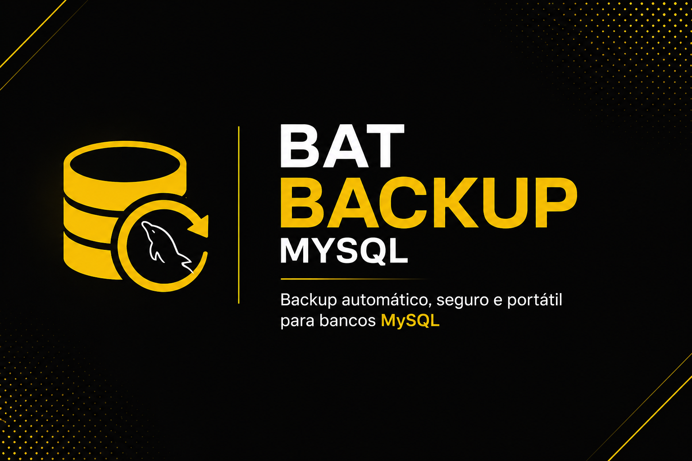

# <div align="center">



# 💾 Bat Backup MySQL

### Backup automático, portátil e inteligente para bancos MySQL


**Solução portátil para backup automático de bancos MySQL utilizando Batch Script.**

Sem dependências externas, com compactação automática, limpeza de arquivos antigos, cópia de segurança em rede e criação automática de tarefas agendadas.

</div>

---

# 📋 Descrição

O **Bat Backup MySQL** foi desenvolvido para simplificar o processo de backup de bancos MySQL em ambientes Windows.

A ferramenta realiza automaticamente:

* Exportação do banco via `mysqldump`
* Compactação utilizando `7-Zip`
* Exclusão automática de backups antigos
* Cópia de segurança para diretório secundário
* Criação automática de tarefa no Agendador do Windows
* Validação da conexão antes da execução

Tudo isso através de um único arquivo `.bat`.

---

# ✨ Funcionalidades

* ✅ Backup automático via `mysqldump`
* ✅ Compatível com bancos com ou sem senha
* ✅ Validação da conexão antes do backup
* ✅ Compactação automática em `.7z`
* ✅ Exclusão automática do arquivo `.sql`
* ✅ Exclusão automática de backups antigos
* ✅ Cópia para diretório secundário
* ✅ Criação automática de tarefas agendadas
* ✅ Horário configurável via variável
* ✅ Totalmente portátil
* ✅ Compatível com Windows 7, 8, 10 e 11
* ✅ Compatível com sistemas x86 e x64

---

# 📦 Estrutura dos Arquivos

```text
BAT/
├── backup.bat
├── mysqldump.exe
├── 7z.exe
├── 7z.dll
└── 7zx.dll
```

---

# ⚙️ Configuração

Abra o arquivo:

```text
backup.bat
```

e configure as variáveis abaixo.

## 🔗 Dados de conexão

```bat
set "SERVIDOR=" => Ip, Hostname ou Host DNS do servidor.
set "USUARIO=" => UserName ou User do banco.
set "BANCO=" => Nome do Schema.
set "SENHA=" => Senha do Banco
```

### Exemplo

```bat
set "SERVIDOR=127.0.0.1" ou srv1234.hstgr.cloud ou localhost
set "USUARIO=root"
set "BANCO=banco_producao"
set "SENHA=123456"
```

> Caso o banco não utilize senha, deixe o campo SENHA vazio.

```bat
set "SENHA="
```

---

## 📁 Nome do arquivo de backup

```bat
set "EMPRESA=nome que ficará no .7z"
set "CAIXA=numero que ficará no .7z"
```

### Exemplo

```bat
set "EMPRESA=TESTE"
set "CAIXA=01"
```
Arquivo gerado:
```text
TESTE-CX01_20260621-1800.7z
```

---

## 💾 Diretório principal

Local onde os backups serão armazenados.

```bat
set "BACKUP=C:\DATABASE\BACKUP\ON\"
```

---

## 🛡️ Diretório secundário

Cópia de segurança local ou em rede.

```bat
set "COPIA=\\LOCALHOST\BACKUP\COPIA\"
```

### Exemplos

```bat
set "COPIA=D:\BACKUP\COPIA\"
```
ou
```bat
set "COPIA=\\SERVIDOR\BACKUP\"
```

---

## 🗑️ Retenção de backups

Quantidade de dias que os arquivos serão mantidos.

```bat
set "DIAS=7"
```

Exemplo:

```text
7 = mantém os últimos 7 dias
30 = mantém os últimos 30 dias
90 = mantém os últimos 90 dias
```

---

## ⏰ Horário automático

Define o horário de execução da tarefa agendada.

```bat
set "HORABACKUP=18:00"
```

Exemplos:

```bat
set "HORABACKUP=12:00"
set "HORABACKUP=18:00"
set "HORABACKUP=23:30"
```

---

# 🚀 Como Usar

## 1. Configure o arquivo

Edite:

```text
backup.bat
```

e ajuste os parâmetros conforme seu ambiente.

---

## 2. Execute como Administrador

Na primeira execução:

```text
Clique com o botão direito
→ Executar como Administrador
```

---

## 3. Tarefa automática

A aplicação verificará se já existe uma tarefa agendada.

Caso não exista:

* Será criada automaticamente.
* Utilizará o horário definido em:

```bat
HORABACKUP
```

---

## 4. Backup automático

O sistema executará:

```text
Banco MySQL
↓
mysqldump
↓
arquivo .sql
↓
compactação .7z
↓
remoção do .sql
↓
cópia de segurança
↓
limpeza de arquivos antigos
```

---

# 🖼️ Screenshots

### Tela principal

```markdown

```

### Fluxo do Backup

```markdown

```

---

# 🔄 Novidades da Versão 2.0

* 🚀 Inclusão do `mysqldump.exe` no próprio diretório
* 🚀 Inclusão do `7-Zip` no próprio diretório
* 🚀 Não depende mais de instalação local do MySQL
* 🚀 Suporte a bancos sem senha
* 🚀 Validação da conexão antes da execução
* 🚀 Criação automática da tarefa agendada
* 🚀 Configuração de horário através da variável `HORABACKUP`
* 🚀 Maior portabilidade entre clientes

---

# 👨‍💻 Autor

**Sandro Luiz**

GitHub:

https://github.com/sandrolsa

---

# 📄 Licença

Distribuído sob a licença MIT.

Sinta-se livre para utilizar, modificar e distribuir.
